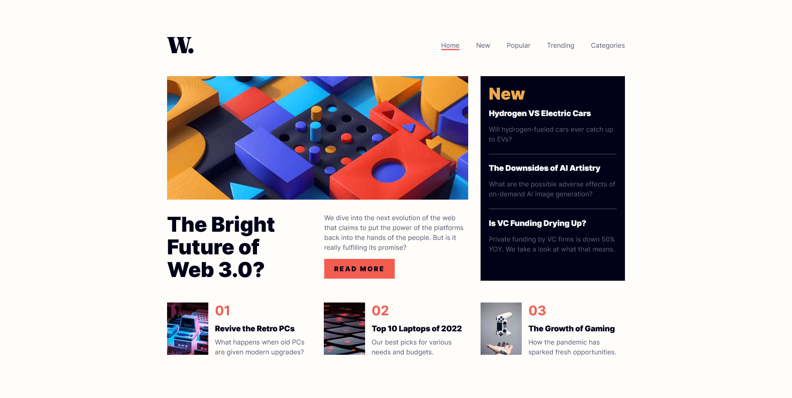

# Frontend Mentor - News homepage solution

This is a solution to the [News homepage challenge on Frontend Mentor](https://www.frontendmentor.io/challenges/news-homepage-H6SWTa1MFl). Frontend Mentor challenges help you improve your coding skills by building realistic projects. 

## Table of contents

- [Overview](#overview)
  - [The challenge](#the-challenge)
  - [Screenshot](#screenshot)
  - [Links](#links)
- [My process](#my-process)
  - [Built with](#built-with)
  - [Useful resources](#useful-resources)
- [Author](#author)
- [Acknowledgments](#acknowledgments)

## Overview

### The challenge

Users should be able to:

- View the optimal layout for the interface depending on their device's screen size
- See hover and focus states for all interactive elements on the page

### Screenshot

### Links

- Solution URL: [Frontend Mentor]()
- Live Site URL: [Github Pages]()

## My process

### Built with

## Useful resources
- [Vite](https://vite.dev/) - Vite documentation
- [TinyPNG](https://tinypng.com/) - Optimize images to make your websites faster 

## Author

- Frontend Mentor - [@bccpadge](https://www.frontendmentor.io/profile/bccpadge)

## Acknowledgments
- [Create a blog with a headless CMS // Full 3-hour course // Astro + Wix Studio](https://www.youtube.com/watch?v=Thudicbgqtg)

